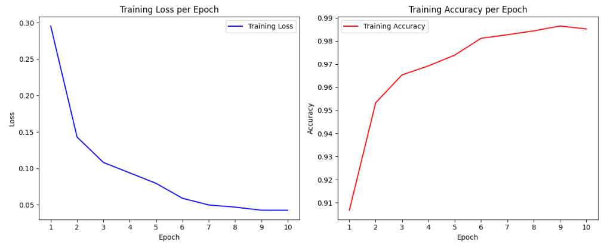
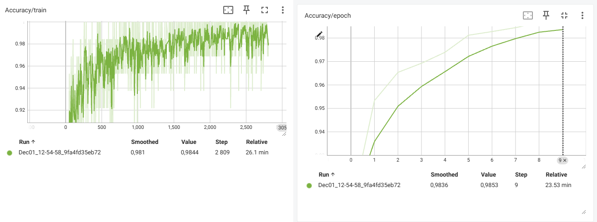
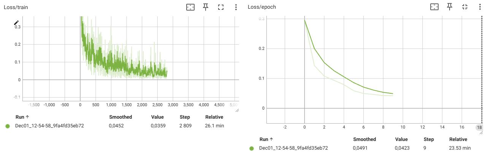
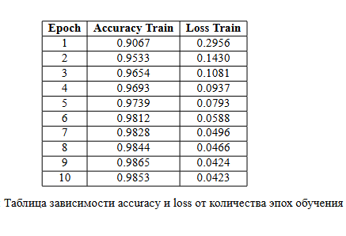

# Решение практического задания №1

# Формулировка задания
Необходимо реализовать модель для классификации фрагментов полнокадровых гистологических изображений (патчей) на 9 классов: [ADI, BACK, DEB, LYM, MUC, MUS, NORM, STR, TUM]. Каждый патч представляет собой цветное (8-bit) изображение 224 × 224 px.

# Реализация модели
В качестве модели классификации была выбрана предобученная модель, основанная на сверточных нейронных сетях - **ResNet-50**. Для реализации использовался фреймворк PyTorch. В процессе обучения использавалась GPU NVIDIA L4 в Google Colab.

# Результаты обучения модели
В процессе обучения модели был запущен TensorBoard для построения графиков, визуализирующих процесс обучения (график зависимости функции потерь от номера эпохи обучения и зависимость accuracy от номера эпохи обучения). Логи тензорборда представлены в файлах репозитория (для проверки). Кроме этого были реализованы обычные графики через библиотеку matplotlib, которые также характеризуют зависимость функции потерь и accuracy от количества эпох.
# Тестирование модели
1. Модель тестируется на 10% от тестового набора данных, значение accuracy и balanced accuracy - 0.9978
2. Модель тестируется на полном тестовом наборе данных, значение accuracy и balanced accuracy - 0.9873
3. Модель тестируется на 2% изображений от другого набора данных, значение accuracy и balanced accuracy - 0.9667
   
# Графики

# Таблица зависимости точности и функции потерь от количества эпох

